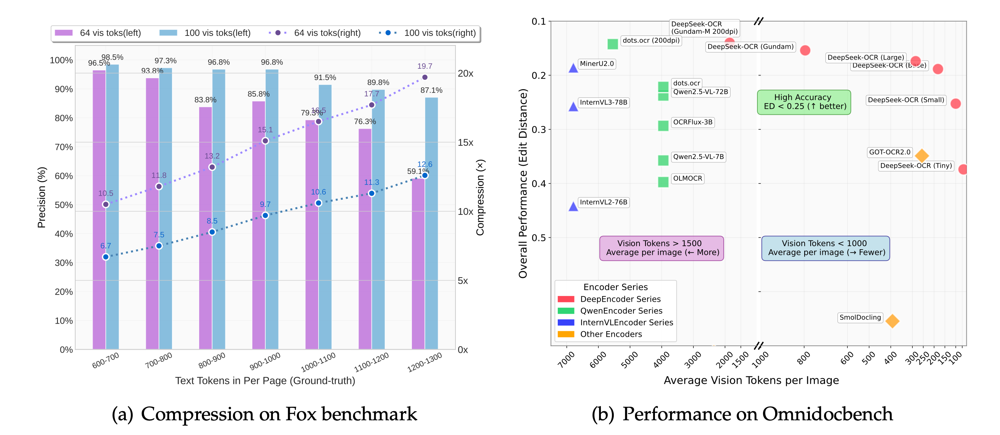

<!-- markdownlint-disable first-line-h1 -->
<!-- markdownlint-disable html -->
<!-- markdownlint-disable no-duplicate-header -->

<div align="center">
  <a href="README.md">English</a> | <a href="README.zh-TW.md">繁體中文</a> | <b>Español</b>
</div>

<div align="center">
  
</div>

<hr>
<div align="center">
  <a href="https://www.deepseek.com/" target="_blank">
    
  </a>
  <a href="https://huggingface.co/deepseek-ai/DeepSeek-OCR" target="_blank">
    
  </a>
</div>

<div align="center">
  <a href="https://discord.gg/Tc7c45Zzu5" target="_blank">
    
  </a>
  <a href="https://twitter.com/deepseek_ai" target="_blank">
    
  </a>
</div>

<p align="center">
  <a href="https://huggingface.co/deepseek-ai/DeepSeek-OCR"><b>📥 Descarga del modelo</b></a> |
  <a href="https://github.com/deepseek-ai/DeepSeek-OCR/blob/main/DeepSeek_OCR_paper.pdf"><b>📄 Enlace al documento</b></a> |
  <a href="https://arxiv.org/abs/2510.18234"><b>📄 Enlace al documento de Arxiv</b></a> |
</p>

<h2>
<p align="center">
  <a href="">DeepSeek-OCR: Compresión óptica de contextos</a>
</p>
</h2>

<p align="center">

</p>
<p align="center">
<a href="">Explora los límites de la compresión visual-texto.</a>
</p>

## Lanzamiento
- [2025/10/23]🚀🚀🚀 DeepSeek-OCR ahora es oficialmente compatible con [vLLM](https://docs.vllm.ai/projects/recipes/en/latest/DeepSeek/DeepSeek-OCR.html#installing-vllm) ascendente. Gracias al equipo de [vLLM](https://github.com/vllm-project/vllm) por su ayuda.
- [2025/10/20]🚀🚀🚀 Lanzamos DeepSeek-OCR, un modelo para investigar el papel de los codificadores de visión desde un punto de vista centrado en LLM.

## Contenido
- [Instalación](#instalación)
- [Inferencia vLLM](#inferencia-vllm)
- [Inferencia de transformadores](#inferencia-de-transformadores)

## Instalación
>Nuestro entorno es cuda11.8+torch2.6.0.
1. Clona este repositorio y navega a la carpeta DeepSeek-OCR
```bash
git clone https://github.com/deepseek-ai/DeepSeek-OCR.git
```
2. Conda
```Shell
conda create -n deepseek-ocr python=3.12.9 -y
conda activate deepseek-ocr
```
3. Paquetes

- descargar el vllm-0.8.5 [whl](https://github.com/vllm-project/vllm/releases/tag/v0.8.5)
```Shell
pip install torch==2.6.0 torchvision==0.21.0 torchaudio==2.6.0 --index-url https://download.pytorch.org/whl/cu118
pip install vllm-0.8.5+cu118-cp38-abi3-manylinux1_x86_64.whl
pip install -r requirements.txt
pip install flash-attn==2.7.3 --no-build-isolation
```
**Nota:** si desea que los códigos vLLM y transformadores se ejecuten en el mismo entorno, no necesita preocuparse por este error de instalación como: vllm 0.8.5+cu118 requiere transformadores>=4.51.1

## Inferencia-vLLM
- VLLM:
>**Nota:** cambie INPUT_PATH/OUTPUT_PATH y otras configuraciones en DeepSeek-OCR-master/DeepSeek-OCR-vllm/config.py
```Shell
cd DeepSeek-OCR-master/DeepSeek-OCR-vllm
```
1. imagen: salida de transmisión
```Shell
python run_dpsk_ocr_image.py
```
2. pdf: concurrencia ~2500tokens/s (un A100-40G)
```Shell
python run_dpsk_ocr_pdf.py
```
3. evaluación por lotes para puntos de referencia
```Shell
python run_dpsk_ocr_eval_batch.py
```

**[2025/10/23] La versión de [vLLM](https://docs.vllm.ai/projects/recipes/en/latest/DeepSeek/DeepSeek-OCR.html#installing-vllm) ascendente:**

```shell
uv venv
source .venv/bin/activate
# Hasta el lanzamiento de v0.11.1, debe instalar vLLM desde la compilación nocturna
uv pip install -U vllm --pre --extra-index-url https://wheels.vllm.ai/nightly
```

```python
from vllm import LLM, SamplingParams
from vllm.model_executor.models.deepseek_ocr import NGramPerReqLogitsProcessor
from PIL import Image

# Crear instancia del modelo
llm = LLM(
    model="deepseek-ai/DeepSeek-OCR",
    enable_prefix_caching=False,
    mm_processor_cache_gb=0,
    logits_processors=[NGramPerReqLogitsProcessor]
)

# Preparar entrada por lotes con su archivo de imagen
image_1 = Image.open("path/to/your/image_1.png").convert("RGB")
image_2 = Image.open("path/to/your/image_2.png").convert("RGB")
prompt = "<image>\nFree OCR."

model_input = [
    {
        "prompt": prompt,
        "multi_modal_data": {"image": image_1}
    },
    {
        "prompt": prompt,
        "multi_modal_data": {"image": image_2}
    }
]

sampling_param = SamplingParams(
            temperature=0.0,
            max_tokens=8192,
            # argumentos del procesador de logits ngram
            extra_args=dict(
                ngram_size=30,
                window_size=90,
                whitelist_token_ids={128821, 128822},  # lista blanca: <td>, </td>
            ),
            skip_special_tokens=False,
        )
# Generar salida
model_outputs = llm.generate(model_input, sampling_param)

# Imprimir salida
for output in model_outputs:
    print(output.outputs[0].text)
```
## Inferencia-de-transformadores
- Transformadores
```python
from transformers import AutoModel, AutoTokenizer
import torch
import os
os.environ["CUDA_VISIBLE_DEVICES"] = '0'
model_name = 'deepseek-ai/DeepSeek-OCR'

tokenizer = AutoTokenizer.from_pretrained(model_name, trust_remote_code=True)
model = AutoModel.from_pretrained(model_name, _attn_implementation='flash_attention_2', trust_remote_code=True, use_safetensors=True)
model = model.eval().cuda().to(torch.bfloat16)

# prompt = "<image>\nFree OCR. "
prompt = "<image>\n<|grounding|>Convierte el documento a markdown. "
image_file = 'your_image.jpg'
output_path = 'your/output/dir'

res = model.infer(tokenizer, prompt=prompt, image_file=image_file, output_path = output_path, base_size = 1024, image_size = 640, crop_mode=True, save_results = True, test_compress = True)
```
o puedes
```Shell
cd DeepSeek-OCR-master/DeepSeek-OCR-hf
python run_dpsk_ocr.py
```
## Modos de soporte
El modelo de código abierto actual admite los siguientes modos:
- Resolución nativa:
  - Pequeño: 512×512 （64 tokens de visión）✅
  - Pequeño: 640×640 （100 tokens de visión）✅
  - Base: 1024×1024 （256 tokens de visión）✅
  - Grande: 1280×1280 （400 tokens de visión）✅
- Resolución dinámica
  - Gundam: n×640×640 + 1×1024×1024 ✅

## Ejemplos de indicaciones
```python
# documento: <image>\n<|grounding|>Convierte el documento a markdown.
# otra imagen: <image>\n<|grounding|>OCR esta imagen.
# sin diseños: <image>\nFree OCR.
# figuras en el documento: <image>\nAnaliza la figura.
# general: <image>\nDescribe esta imagen en detalle.
# rec: <image>\nUbica <|ref|>xxxx<|/ref|> en la imagen.
# '先天下之忧而忧'
```

## Visualizaciones
<table>
<tr>
<td></td>
<td></td>
</tr>
<tr>
<td></td>
<td></td>
</tr>
</table>

## Agradecimiento

Nos gustaría agradecer a [Vary](https://github.com/Ucas-HaoranWei/Vary/), [GOT-OCR2.0](https://github.com/Ucas-HaoranWei/GOT-OCR2.0/), [MinerU](https://github.com/opendatalab/MinerU), [PaddleOCR](https://github.com/PaddlePaddle/PaddleOCR), [OneChart](https://github.com/LingyvKong/OneChart), [Slow Perception](https://github.com/Ucas-HaoranWei/Slow-Perception) por sus valiosos modelos e ideas.

También apreciamos los puntos de referencia: [Fox](https://github.com/ucaslcl/Fox), [OminiDocBench](https://github.com/opendatalab/OmniDocBench).

## Citación

```bibtex
@article{wei2024deepseek-ocr,
  title={DeepSeek-OCR: Contexts Optical Compression},
  author={Wei, Haoran and Sun, Yaofeng and Li, Yukun},
  journal={arXiv preprint arXiv:2510.18234},
  year={2025}
}
```
